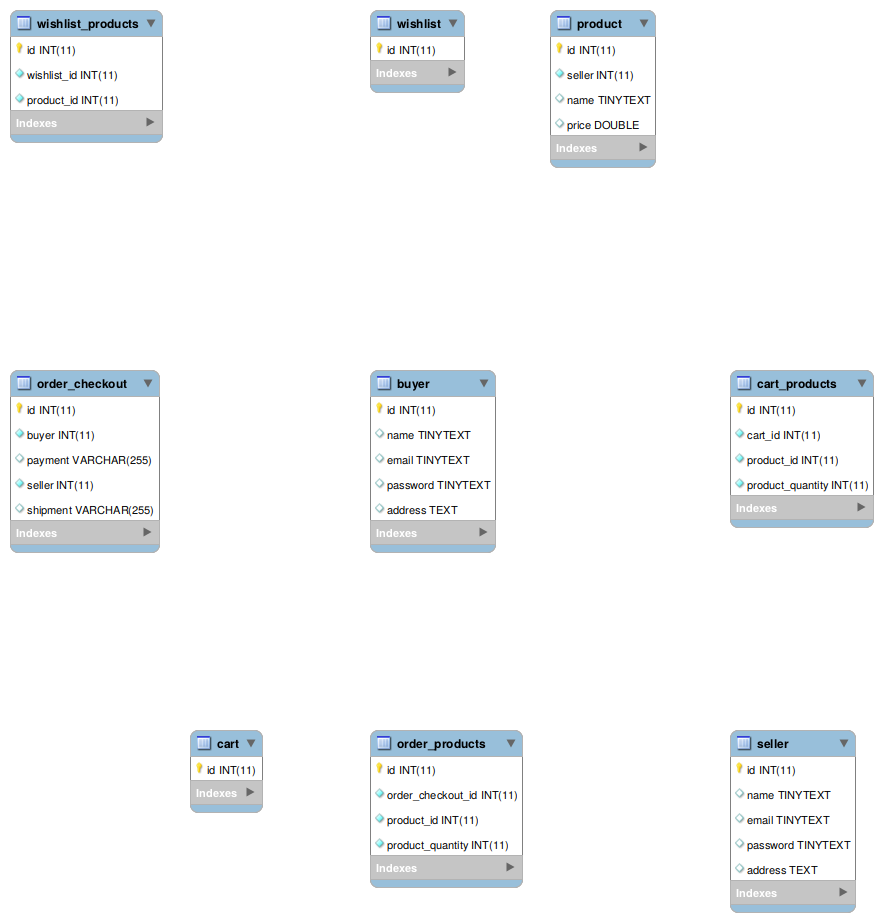

# E-Commerce Service

## Description

E-commerce is a domain that serves buying and selling products over the internet. This domain provides services such as searching product, buying product, selling product, paying product, delivering product, and else. This domain works together with payment gateway and logistic to fulfill the services.

## Entity Service

### Buyer

Method | Path | Description
--- | --- | ---
**GET** | `/buyers` | Read all buyers
**GET** | `/buyers/{id}` | Read buyer with {id}
**POST** | `/buyers` | Create a buyer
**DELETE** | `/buyers/{id}` | Delete buyer with {id}
**UPDATE** | `/buyers/{id}` | Update buyer with {id}

### Seller

Method | Path | Description
--- | --- | ---
**GET** | `/sellers` | Read all sellers
**GET** | `/sellers/{id}` | Read seller with {id}
**POST** | `/sellers` | Create a seller
**DELETE** | `/sellers/{id}` | Delete seller with {id}
**UPDATE** | `/sellers/{id}` | Update seller with {id}

### Product

Method | Path | Description
--- | --- | ---
**GET** | `/products` | Read all products
**GET** | `/products/{id}` | Read product with {id}
**POST** | `/products` | Create a product
**DELETE** | `/products/{id}` | Delete product with {id}
**UPDATE** | `/products/{id}` | Update product with {id}

### Order

Method | Path | Description
--- | --- | ---
**GET** | `/orders` | Read all orders
**GET** | `/orders/{id}` | Read order with {id}
**POST** | `/orders` | Create a order
**DELETE** | `/orders/{id}` | Delete order with {id}
**UPDATE** | `/orders/{id}` | Update order with {id}

### Order Products

Method | Path | Description
--- | --- | ---
**GET** | `/orders/products` | Read all order products
**GET** | `/orders/products/{id}` | Read order product with {id}
**POST** | `/orders/products` | Create a order product
**DELETE** | `/orders/products/{id}` | Delete order product with {id}
**UPDATE** | `/orders/products/{id}` | Update order product with {id}

### Cart

Method | Path | Description
--- | --- | ---
**GET** | `/carts` | Read all carts
**GET** | `/carts/{id}` | Read cart with {id}
**POST** | `/carts` | Create a cart
**DELETE** | `/carts/{id}` | Delete cart with {id}
**UPDATE** | `/carts/{id}` | Update cart with {id}

### Cart Products

Method | Path | Description
--- | --- | ---
**GET** | `/carts/products` | Read all cart products
**GET** | `/carts/products/{id}` | Read cart product with {id}
**POST** | `/carts/products` | Create a cart product
**DELETE** | `/carts/products/{id}` | Delete cart product with {id}
**UPDATE** | `/carts/products/{id}` | Update cart product with {id}

### Wishlist

Method | Path | Description
--- | --- | ---
**GET** | `/wishlists` | Read all wishlists
**GET** | `/wishlists/{id}` | Read wishlist with {id}
**POST** | `/wishlists` | Create a wishlist
**DELETE** | `/wishlists/{id}` | Delete wishlist with {id}
**UPDATE** | `/wishlists/{id}` | Update wishlist with {id}

### Wishlist Products

Method | Path | Description
--- | --- | ---
**GET** | `/wishlists/products` | Read all wishlist products
**GET** | `/wishlists/products/{id}` | Read wishlist product with {id}
**POST** | `/wishlists/products` | Create a wishlist product
**DELETE** | `/wishlists/products/{id}` | Delete wishlist product with {id}
**UPDATE** | `/wishlists/products/{id}` | Update wishlist product with {id}

## Member

1. 13514015 - Nur Latifah Ulfah
2. 13515048 - Alvin Sullivan
3. 13515079 - Nicholas Thie